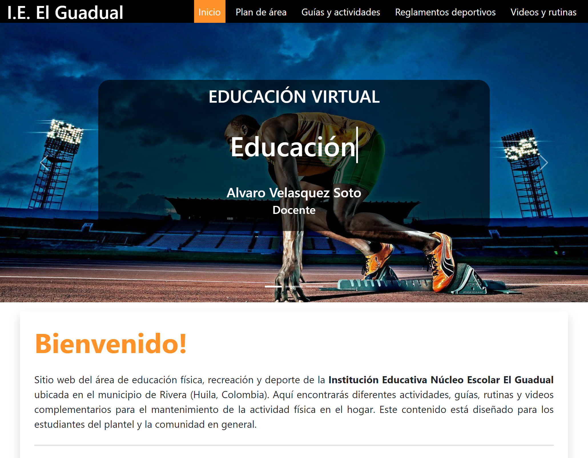
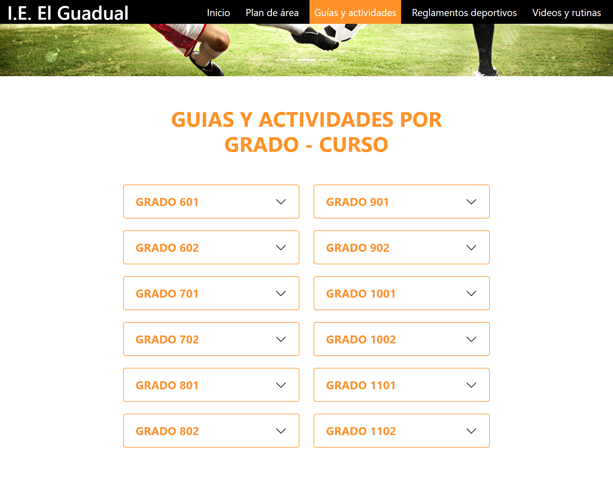

# WebEdufisica 📚⚽

Website of the physical education, recreation and sports area of the Educational Institution <i>Núcleo Escolar El Guadual</i> located in the municipality of Rivera (Huila, Colombia). Here you will find different activities, guides, routines and complementary videos for maintaining physical activity at home. This content is designed for students on campus and the community at large.

This website was developed with HTML, CSS, and JavaScritpt. In addition, it was implemented as a SPA site (single page application) via AJAX. You can view it on the web server through the following link: <a href="https://bluedokk.github.io/WebEdufisica/index.html">https://bluedokk.github.io/WebEdufisica/index.html</a>

## Homepage
 
## Digital content
 
## Contact form 
 
 

<i>Developed by engineer Javier Velasquez for the educational institution Núcleo Escolar El Guadual (2021)</i>
